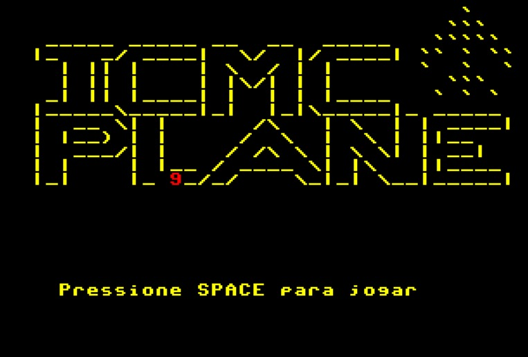
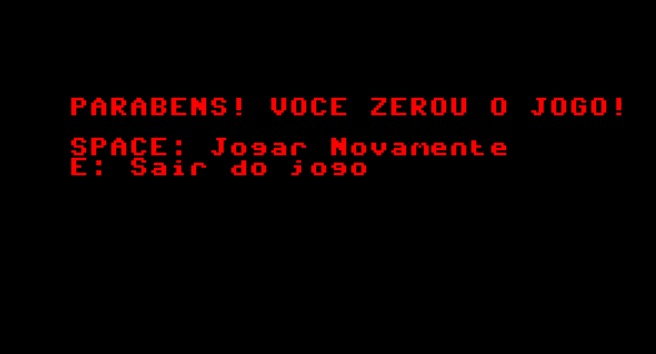

# ✈️ ICMC Plane - Jogo em Assembly  
**Disciplina:** Organização e Arquitetura de Computadores   
**Projeto:** Jogo de Corrida contra Obstáculos em Assembly Puro  

---

## 📄 Introdução

O **ICMC Plane** é um jogo de corrida desenvolvido inteiramente em **Assembly** para o processador do ICMC.  
O projeto demonstra:

- Controle de fluxo  
- Manipulação de memória  
- Entrada e saída (I/O)  
- Lógica de programação de baixo nível  

---

## 🎮 Como Jogar

O objetivo é pilotar o avião, desviar dos obstáculos e sobreviver tempo suficiente para conquistar **5 estrelas** e zerar o jogo.

---

## 🕹️ Comandos

| Tecla | Ação |
|-------|------|
| **a** | Move o avião para a esquerda |
| **d** | Move o avião para a direita |

---

## 🚦 Elementos do Jogo

- **Avião:** Representado pelo caractere `` ` ``  
- **Obstáculos:** Representados pelos símbolos `$`(Balão) e `%` (Bomba)  
- **Estrelas:** Você ganha uma estrela a cada ciclo de pontuação. Ao juntar **5**, vence a corrida  

---

## 🛠️ Funcionamento do Código

O código é modular, organizado em sub-rotinas (`call` / `rts`).  
A seguir, os principais componentes:

---

### 1. Loop Principal (`GameLoop`)

A cada iteração:

1. Atualiza a entropia usada no sistema aleatório  
2. Desenha o cenário (`Desenhar_TelaJogo`)  
3. Lê os comandos do jogador (`InputTeclado`)  
4. Move obstáculos (`MovimentoObstaculos`)  
5. Gera novos obstáculos (`SpawnObstaculos`)  
6. Atualiza o score (`AtualizaScore`)  
7. Executa um atraso para controlar a velocidade do jogo (`Delay`)  

---

### 2. Geração Aleatória (`Random` e `Entropy`)

- Como o processador é determinístico, foi criada uma variável de **entropia** incrementada no loop principal.  
- A função `Random` soma essa entropia a valores da tabela `RandTable`, garantindo posições imprevisíveis para os obstáculos.

---

### 3. Manipulação de Obstáculos

- **Spawn:** Obstáculos aparecem na linha superior (colunas 0 a 39)  
- **Movimento:**  
  - Percorre os obstáculos  
  - Apaga a posição anterior  
  - Move 1 linha para baixo (soma 40 ao endereço)  
  - Redesenha o caractere  
- **Colisão:**  
  - Se a posição de um obstáculo = posição do avião (`AviaoPos`), o jogo vai para `GameOver`

---

### 4. Sistema de Cores e Gráficos

O jogo usa escrita direta em vídeo:

- As cores são aplicadas somando valores (ex: `2816` para cor amarelo) ao código ASCII

- O cenário é desenhado a partir de vetores (`TelaInicial`, `TelaJogo`).

---

## 📺 Vídeo Demonstrativo

Acesse o nosso [vídeo demonstrativo]().

*O vídeo será inserido em breve!*

---

## 📸 Screenshots

### 1. Tela Inicial

### 2. Gameplay

### 3. Vitória

### 4. Game Over

---

## 👨‍💻 Autores

Projeto desenvolvido como **trabalho final da disciplina de Organização e Arquitetura de Computadores**.

- Gustavo Furlan
- Leonardo Brito
- Lucas Xavier

---
